# AI 代码生成追踪系统 设计手册

> **版本**：v1.4.0
> **最后更新**：2026-04-01
> **适用项目**：nl2sql-langgraph（所有使用 Claude Code 开发的项目均可参考）

---

## 目录

1. [系统概述](#1-系统概述)
2. [整体架构](#2-整体架构)
3. [核心组件详解](#3-核心组件详解)
   - 3.1 [PostToolUse Hook](#31-posttooluse-hook)
   - 3.2 [Session 文件](#32-session-文件)
   - 3.3 [pre-commit Hook](#33-pre-commit-hook)
   - 3.4 [prepare-commit-msg Hook](#34-prepare-commit-msg-hook)
   - 3.5 [report.py 报告生成器](#35-reportpy-报告生成器)
   - 3.6 [install.js 安装脚本](#36-installjs-安装脚本)
   - 3.7 [reset-session.js 重置工具](#37-reset-sessionjs-重置工具)
4. [数据结构规范](#4-数据结构规范)
   - 4.1 [Session JSON 格式](#41-session-json-格式)
   - 4.2 [Git Commit Trailer 格式](#42-git-commit-trailer-格式)
5. [完整数据流](#5-完整数据流)
6. [安装与配置](#6-安装与配置)
7. [使用指南](#7-使用指南)
8. [多人团队协作](#8-多人团队协作)
9. [报告解读](#9-报告解读)
10. [已知限制](#10-已知限制)
11. [Bug 修复记录](#11-bug-修复记录)
12. [故障排查](#12-故障排查)
13. [文件目录结构](#13-文件目录结构)
14. [多 AI 工具适配指南](#14-多-ai-工具适配指南)
   - 14.1 [适配原理](#141-适配原理)
   - 14.2 [适配架构图](#142-适配架构图)
   - 14.3 [核心适配模块：session-writer.js](#143-核心适配模块session-writerjs)
   - 14.4 [通用文件监听适配器](#144-通用文件监听适配器)
   - 14.5 [Codex CLI 适配方案](#145-codex-cli-适配方案)
   - 14.6 [OpenCode 适配方案](#146-opencode-适配方案)
   - 14.7 [Aider 适配方案](#147-aider-适配方案)
   - 14.8 [适配方案选型建议](#148-适配方案选型建议)

---

## 1. 系统概述

### 1.1 背景与目标

随着 AI 编程工具（Claude Code）的广泛使用，团队需要一套机制来**量化 AI 生成代码在项目中的占比**，以便：

- 评估 AI 工具对开发效率的提升效果
- 追踪团队成员的 AI 工具使用情况
- 在 Code Review 时识别 AI 生成的代码段
- 为工程管理提供数据支撑

### 1.2 设计原则

| 原则 | 说明 |
|------|------|
| **零感知集成** | 开发者无需手动操作，系统自动在后台追踪 |
| **Git 原生** | 追踪数据存储在 Git commit metadata，无额外数据库 |
| **多人无冲突** | 每位开发者独立的 session 文件，命名保证唯一性 |
| **精确计量** | 基于 `git diff --numstat` 精确统计行数 |
| **可追溯** | 所有历史数据持久化在 Git 仓库中 |
| **向后兼容** | 兼容旧格式的历史提交数据 |

### 1.3 系统边界

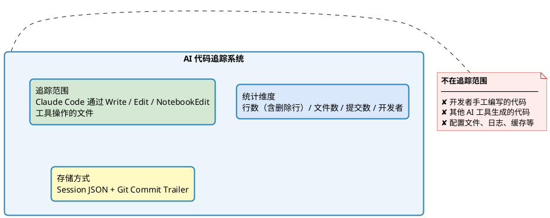

---

## 2. 整体架构

### 2.1 五层架构

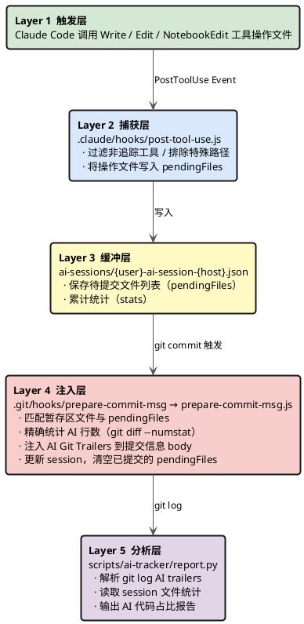

### 2.2 Hook 调用链

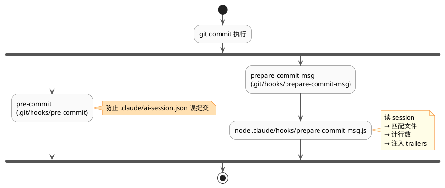

---

## 3. 核心组件详解

### 3.1 PostToolUse Hook

**文件**：`.claude/hooks/post-tool-use.js`
**触发时机**：Claude Code 每次执行 `Write`、`Edit` 或 `NotebookEdit` 工具后自动调用

#### 过滤规则

| 过滤条件 | 说明 |
|---------|------|
| 工具类型 ≠ Write/Edit/NotebookEdit | 跳过（不追踪 Bash、Read 等工具） |
| 路径包含 `/.claude/` | 跳过（框架内部文件） |
| 路径包含 `/.git/` | 跳过（git 内部文件） |
| 路径匹配 session 文件名 | 跳过（防止 session 自追踪） |
| 路径包含 `/node_modules/` | 跳过 |
| 路径包含 `/venv/` `/env/` | 跳过（Python 虚拟环境） |
| 路径包含 `/dist/` `/build/` | 跳过（构建产物） |
| 路径包含 `/__pycache__/` | 跳过（Python 缓存） |
| 扩展名 `.pyc` `.pyo` `.pyd` | 跳过 |
| 扩展名 `.log` `.db` `.sqlite3` | 跳过（运行时文件） |
| 路径匹配 `.env` | 跳过（环境变量） |

#### 核心逻辑

```javascript
// 追踪 Write、Edit 和 NotebookEdit 工具
// NotebookEdit 使用 notebook_path，Write/Edit 使用 file_path
const filePath = toolInput.file_path || toolInput.notebook_path || '';

// 1. 定位 session 文件（路径格式：ai-sessions/{username}-ai-session-{hostname}.json）
const username = sanitize(os.userInfo().username);  // 清理特殊字符，小写，≤30字符
const hostname = sanitize(os.hostname());

// 2. 每次操作时同步最新模型信息（防止切换模型后 session 中的 model 字段过期）
const currentModel = process.env.ANTHROPIC_DEFAULT_SONNET_MODEL;
if (currentModel) { session.model = currentModel; }

// 3. 更新 pendingFiles（同一文件多次编辑时 operations 递增）
const existingIndex = session.pendingFiles.findIndex(f => f.path === normalizedPath);
if (existingIndex >= 0) {
    session.pendingFiles[existingIndex].operations += 1;
    session.pendingFiles[existingIndex].lastTool = toolName;
    session.pendingFiles[existingIndex].lastModified = new Date().toISOString();
} else {
    session.pendingFiles.push({ path, tool, operations: 1, timestamp, lastModified });
    session.stats.totalFilesEdited += 1;
}

// 4. 累加总操作次数
session.stats.totalOperations += 1;
```

#### 注意事项

- `totalFilesEdited` 以**文件为单位**，同一文件多次编辑只计 1 次
- `totalOperations` 以**操作次数为单位**，同一文件每次编辑都计 1 次
- 路径统一转换为**正斜杠**格式（兼容 Windows）
- `model` 字段在**每次操作时**同步更新，始终反映当前使用的模型
- `NotebookEdit` 追踪 `.ipynb` Jupyter 笔记本文件，路径来自 `notebook_path` 字段

---

### 3.2 Session 文件

**路径**：`ai-sessions/{username}-ai-session-{hostname}.json`
**作用**：作为 "未提交 AI 代码" 的临时缓冲区，记录待提交的文件

**文件命名规则**：

```
username = sanitize(os.userInfo().username)
         = 替换非字母数字字符为 _ → 转小写 → 截取前30字符

hostname = sanitize(os.hostname())
         = 同上规则

文件名 = {username}-ai-session-{hostname}.json

示例：
  用户 "Administrator" 在 "DESKTOP-TC94458" 上
  → administrator-ai-session-desktop-tc94458.json
```

**生命周期**：

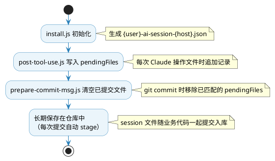

---

### 3.3 pre-commit Hook

**文件**：`.git/hooks/pre-commit`（由 install.js 生成）
**目的**：将当前开发者的 AI session 文件自动加入暂存区，确保 session 文件随代码一起提交

```bash
#!/bin/sh
# 功能：将当前开发者的 AI session 文件自动加入暂存区
SESSION_FILE=$(node -e "
const os=require('os');
const s=x=>(x||'unknown').replace(/[^a-zA-Z0-9_-]/g,'_').toLowerCase().slice(0,30);
console.log('ai-sessions/'+s(os.userInfo().username)+'-ai-session-'+s(os.hostname())+'.json');
" 2>/dev/null)

if [ -n "$SESSION_FILE" ] && [ -f "$SESSION_FILE" ]; then
  git add "$SESSION_FILE" 2>/dev/null || true
fi
exit 0
```

**为什么需要这个 Hook**：
- 确保每次业务代码提交时，session 文件同步入库
- 与 `prepare-commit-msg` Hook 分工：pre-commit 负责 stage，prepare-commit-msg 负责注入元数据

---

### 3.4 prepare-commit-msg Hook

**入口**：`.git/hooks/prepare-commit-msg`（Shell 脚本）
**实现**：`.claude/hooks/prepare-commit-msg.js`（Node.js 脚本）

#### 执行流程（9 步）

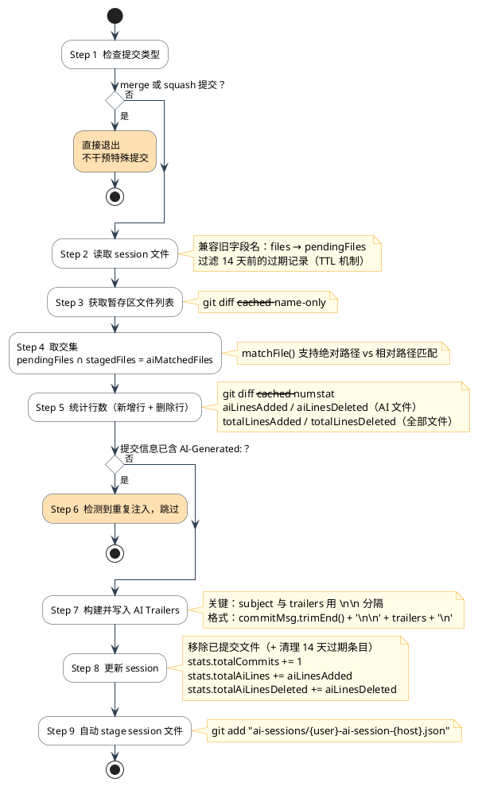

#### pendingFiles TTL 机制

为防止废弃的 pendingFiles 记录（如：已被删除的文件、忘记提交的旧文件）污染后续提交的 Trailer，系统对超过 14 天未提交的记录自动过滤：

```javascript
const STALE_TTL_MS = 14 * 24 * 60 * 60 * 1000;  // 14 天
const nowMs = Date.now();
const pendingFiles = allPendingFiles.filter(f => {
    const ts = new Date(f.lastModified || f.timestamp || 0).getTime();
    // 无时间戳的旧格式条目保留（向后兼容）；有时间戳的超期条目过滤
    return !ts || (nowMs - ts) < STALE_TTL_MS;
});
```

#### 文件路径匹配算法

Session 中存储的是**绝对路径**，`git diff` 返回的是**相对路径**，匹配函数处理这个差异：

```javascript
const matchFile = (sessionPath, stagedPath) => {
    const sp = sessionPath.replace(/\\/g, '/');  // 标准化：统一正斜杠
    const st = stagedPath.replace(/\\/g, '/');
    return (
        sp === st ||                    // 完全相等（两者都是相对路径时）
        sp.endsWith('/' + st) ||        // session绝对路径 以 /相对路径 结尾 ✅ 主要匹配方式
        st.endsWith('/' + sp) ||        // 反向匹配
        sp.endsWith(st)                 // 包含关系
    );
};
```

**示例**：
```
session 存储：D:/project/module_admin/service/user_service.py
git 返回：    module_admin/service/user_service.py

匹配判断：
  sp.endsWith('/' + st)
  = "D:/project/module_admin/service/user_service.py"
    .endsWith("/module_admin/service/user_service.py")
  = true ✅
```

#### AI Trailer 注入格式

```
{原始提交信息}

AI-Generated: true
AI-Tool: claude-code
AI-Model: claude-sonnet-4-6
AI-Lines: 150
AI-Lines-Deleted: 20
AI-Total-Lines: 200
AI-Total-Lines-Deleted: 30
AI-Files: 3
AI-File-List: service/user_service.py, controller/user_controller.py (+1 more)
AI-Developer: administrator@desktop-tc94458
```

> ⚠️ **关键设计**：subject 与 trailers 之间必须有空行（`\n\n`）。
> Git 规则：只有存在空行分隔时，body 才被识别为独立段落。
> 否则 trailers 会进入 subject，导致 `git log %b` 为空，report.py 无法解析。

---

### 3.5 report.py 报告生成器

**文件**：`scripts/ai-tracker/report.py`

#### 数据来源

| 数据源 | 内容 | 用途 |
|--------|------|------|
| `git log --format=...` | 提交信息中的 AI trailers | 按提交统计 AI 行数 |
| `git log --numstat` | 所有提交的行数变化 | 计算总行数基数 |
| `ai-sessions/*.json` | 开发者级别的累计统计 | 按开发者展示统计 |

#### 解析逻辑

```python
# 1. 从 git log body 解析 trailers（正常路径）
for line in body_lines:
    if line.startswith('AI-Generated:'):
        c['ai_generated'] = line.split(':', 1)[1].strip().lower() in ('true', '1', 'yes')
    elif line.startswith('AI-Lines:'):
        c['ai_lines'] = int(line.split(':', 1)[1].strip())
    # ... 其他字段

# 2. 兼容旧格式：从 subject 行解析 trailers（历史遗留提交）
if not c['ai_generated'] and 'AI-Generated:' in c.get('subject', ''):
    _parse_trailers_from_subject(c['subject'], c)
```

#### 命令行参数

```bash
python scripts/ai-tracker/report.py [选项]

选项：
  --since DATE        指定分析起始日期（格式：YYYY-MM-DD）
  --developer NAME    按开发者过滤（用户名或 user@host）
  --author NAME       同 --developer（别名，两者等价）
  --format FORMAT     输出格式：console（默认）、json 或 html
  --output FILE       HTML 报告输出路径（--format html 时有效，默认 ai-report.html）
  --top N             最近 N 条 AI 提交明细（默认 10）
  --sessions-only     只显示 session 文件统计，跳过 git log 分析
```

#### 报告输出结构（console 格式）

```
[ 总体概览 ]            - 总提交数、AI 提交数、AI 提交占比
[ 代码行数 ]            - 总新增行数、AI 生成行数、AI 删除行数、净增行数、占比 + 可视化
[ 开发者 AI 使用统计 ]  - 来自 session 文件，按开发者展示（含删除/净增行）
[ 开发者贡献分解 ]      - 来自 git trailers，多人时显示各人分解（新增）
[ AI 模型分布 ]         - 按模型统计使用次数和行数
[ 效率指标 ]            - 均值行/次、均值占比%、最大单次提交（新增）
[ 提交规模分布 ]        - 5 档规模分布（<20 / 20-100 / 100-300 / 300-1k / 1k+）（新增）
[ 周度趋势 ]            - 近 8 周 AI 提交情况（新增）
[ 文件类型分布 (Top 10) ] - 按文件后缀统计（新增）
[ 月度趋势 ]            - 按月统计 AI 提交情况（≥2个月时显示）
[ 最近 N 条 AI 提交 ]   - 最近 AI 提交明细（含删除行）
```

#### HTML 报告功能

`--format html` 生成自包含现代化 HTML 报告（白色主题），无需服务器，直接用浏览器打开：

| 功能 | 说明 |
|------|------|
| KPI 卡片 | AI 提交率、AI 代码占比、净增行数、效率均值，带进度条 |
| 月度趋势图 | 柱状 + 折线叠加，近 12 个月 AI 行数与提交数 |
| 模型分布图 | 甜甜圈图，各模型占比 |
| 文件类型图 | 横向条形图，Top 10 文件后缀 |
| 提交规模图 | 5 档提交大小分布 |
| 开发者分解表 | 多人团队各人 AI 贡献（来自 git trailers） |
| Session 统计表 | 本地累计数据（来自 session 文件） |
| 提交记录搜索 | 实时搜索（哈希/开发者/主题/文件） |
| 多列排序 | 点击表头按日期/行数/文件数等排序 |
| CSV / JSON 导出 | 导出当前筛选结果 |
| 打印支持 | 隐藏工具栏，优化打印布局 |

---

### 3.6 install.js 安装脚本

**文件**：`scripts/ai-tracker/install.js`
**执行**：`node scripts/ai-tracker/install.js`
**前提**：在 git 仓库根目录执行，需要已安装 Node.js

#### 安装步骤（7 步）

| 步骤 | 动作 | 说明 |
|------|------|------|
| Step 1 | 验证依赖文件 | 检查 `.claude/hooks/post-tool-use.js` 和 `prepare-commit-msg.js` 是否存在 |
| Step 2 | 创建 `ai-sessions/` 目录 | 同时创建 `.gitkeep` 确保目录可被 git 追踪 |
| Step 3 | 初始化 session 文件 | 尝试迁移旧版 `.claude/ai-session.json` 的统计数据 |
| Step 4 | 安装 `prepare-commit-msg` hook | 生成 shell 脚本，调用 Node.js 实现 |
| Step 5 | 安装 `pre-commit` hook | 防止 `.claude/ai-session.json` 被误提交 |
| Step 6 | 清理旧版 `.gitignore` 配置 | 移除 `ai-sessions/` 的排除项（应该提交） |
| Step 7 | 加入 git 追踪暂存区 | `git add ai-sessions/` |

---

### 3.7 reset-session.js 重置工具

**文件**：`scripts/ai-tracker/reset-session.js`

#### 两种模式

```bash
# 模式 1：软重置（只清空 pendingFiles，保留统计数据）
node scripts/ai-tracker/reset-session.js
# 使用场景：误操作导致 pendingFiles 混乱，需要清空重新开始

# 模式 2：完全重置（清空 pendingFiles + 重置所有统计）
node scripts/ai-tracker/reset-session.js --full
# 使用场景：需要从零开始统计（如新项目阶段开始）
```

---

## 4. 数据结构规范

### 4.1 Session JSON 格式

```json
{
  "developer": "administrator",
  "hostname": "desktop-tc94458",
  "model": "claude-sonnet-4-6-cc",
  "firstSeen": "2026-03-01T16:15:09.610Z",
  "lastUpdated": "2026-03-06T08:30:00.000Z",
  "stats": {
    "totalOperations": 12,
    "totalFilesEdited": 8,
    "totalAiLines": 943,
    "totalAiLinesDeleted": 120,
    "totalCommits": 5
  },
  "pendingFiles": [
    {
      "path": "D:/project/module_admin/service/user_service.py",
      "tool": "Write",
      "operations": 3,
      "timestamp": "2026-03-06T08:00:00.000Z",
      "lastModified": "2026-03-06T08:20:00.000Z"
    }
  ]
}
```

#### 字段说明

| 字段 | 类型 | 说明 |
|------|------|------|
| `developer` | string | 开发者用户名（经 sanitize 处理） |
| `hostname` | string | 主机名（经 sanitize 处理） |
| `model` | string | Claude 模型 ID（每次操作时同步更新） |
| `firstSeen` | ISO8601 | session 文件首次创建时间 |
| `lastUpdated` | ISO8601 | 最后一次更新时间 |
| `stats.totalOperations` | int | Claude 总写/改操作次数（每次工具调用 +1） |
| `stats.totalFilesEdited` | int | 被 Claude 编辑过的文件总数（去重） |
| `stats.totalAiLines` | int | 累计 AI 生成代码行数（commit 时累加） |
| `stats.totalAiLinesDeleted` | int | 累计 AI 删除代码行数（commit 时累加，**新增字段**） |
| `stats.totalCommits` | int | 通过系统追踪的提交次数 |
| `pendingFiles` | array | 已被 Claude 修改但尚未提交的文件 |
| `pendingFiles[].path` | string | 文件绝对路径（统一正斜杠） |
| `pendingFiles[].tool` | string | 操作工具（Write / Edit / NotebookEdit） |
| `pendingFiles[].operations` | int | 该文件的编辑次数 |
| `pendingFiles[].timestamp` | ISO8601 | 首次编辑时间 |
| `pendingFiles[].lastModified` | ISO8601 | 最后编辑时间（用于 TTL 过期判断） |

### 4.2 Git Commit Trailer 格式

Trailers 遵循 [Git Trailer 标准](https://git-scm.com/docs/git-interpret-trailers)，位于提交信息的 **body** 段落（与 subject 之间有空行）：

```
feat(system): 新增用户管理模块

实现用户的 CRUD 功能，包括分页查询、新增、修改、逻辑删除。

AI-Generated: true
AI-Tool: claude-code
AI-Model: claude-sonnet-4-6
AI-Lines: 350
AI-Lines-Deleted: 45
AI-Total-Lines: 420
AI-Total-Lines-Deleted: 60
AI-Files: 3
AI-File-List: service/user_service.py, controller/user_controller.py, dao/user_dao.py
AI-Developer: administrator@desktop-tc94458
```

#### Trailer 字段说明

| Trailer | 类型 | 说明 |
|---------|------|------|
| `AI-Generated` | bool | 固定为 `true`（标识此提交含 AI 生成代码） |
| `AI-Tool` | string | 固定为 `claude-code` |
| `AI-Model` | string | Claude 模型名（去掉内部 `-cc` 后缀） |
| `AI-Lines` | int | 本次提交中 AI 文件的新增行数 |
| `AI-Lines-Deleted` | int | 本次提交中 AI 文件的删除行数（**新增字段**） |
| `AI-Total-Lines` | int | 本次提交的总新增行数（所有暂存文件） |
| `AI-Total-Lines-Deleted` | int | 本次提交的总删除行数（所有暂存文件，**新增字段**） |
| `AI-Files` | int | 本次提交中 AI 编辑的文件数 |
| `AI-File-List` | string | AI 文件列表，最多显示 5 个，超过显示 `(+N more)` |
| `AI-Developer` | string | 开发者标识：`{username}@{hostname}` |

---

## 5. 完整数据流

### 5.1 正常提交流程

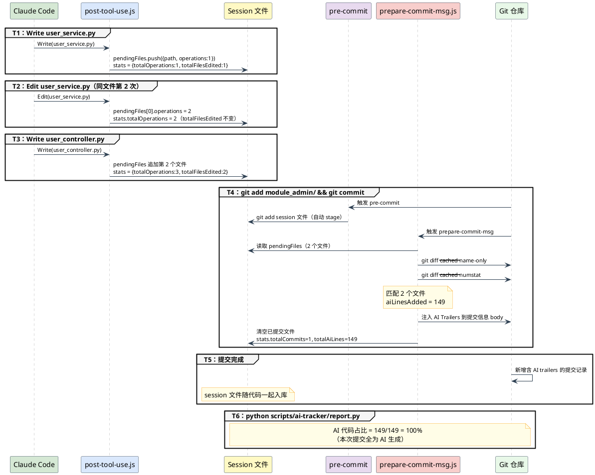

### 5.2 分批提交流程

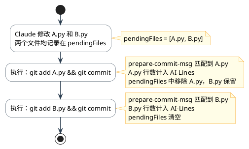

### 5.3 手动提交流程

> **结论**：用户手动执行 `git commit` 与通过对话提交效果相同，Hook 会自动运行。

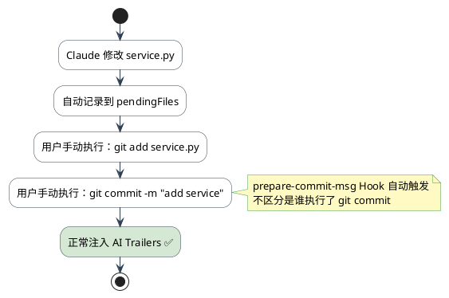

---

## 6. 安装与配置

### 6.1 前提条件

| 要求 | 说明 |
|------|------|
| Git 仓库 | 必须在 git 仓库根目录执行 |
| Node.js | 用于运行 Hook 脚本（建议 v16+） |
| Python 3 | 用于运行 report.py（建议 v3.9+） |
| Claude Code | 已安装并配置 |

### 6.2 安装步骤

```bash
# 1. 克隆仓库（或在现有仓库中）
git clone <repo-url>
cd <project>

# 2. 验证依赖文件存在
ls .claude/hooks/post-tool-use.js
ls .claude/hooks/prepare-commit-msg.js

# 3. 一键安装（每位团队成员都需要执行一次）
node scripts/ai-tracker/install.js

# 4. 验证安装结果
ls -la .git/hooks/prepare-commit-msg  # 应有可执行权限 -rwxr-xr-x
ls -la .git/hooks/pre-commit          # 应有可执行权限 -rwxr-xr-x
ls ai-sessions/                       # 应有 {user}-ai-session-{host}.json
```

### 6.3 验证安装

```bash
# 检查 session 文件是否生成
cat ai-sessions/*.json

# 测试 Hook 是否正常（让 Claude 修改一个文件后查看 session）
cat ai-sessions/$(whoami | tr '[:upper:]' '[:lower:]')-ai-session-*.json | python -c "
import json, sys
d = json.load(sys.stdin)
print(f'开发者: {d[\"developer\"]}')
print(f'主机: {d[\"hostname\"]}')
print(f'待提交文件数: {len(d.get(\"pendingFiles\", []))}')
"
```

### 6.4 配置说明

目前系统无需额外配置，所有参数通过环境自动检测：

| 参数 | 来源 | 示例 |
|------|------|------|
| 开发者用户名 | `os.userInfo().username` | `administrator` |
| 主机名 | `os.hostname()` | `desktop-tc94458` |
| 模型名称 | `process.env.ANTHROPIC_DEFAULT_SONNET_MODEL` | `claude-sonnet-4-6-cc` |
| 项目根目录 | `git rev-parse --show-toplevel` | `/d/project` |

---

## 7. 使用指南

### 7.1 日常工作流

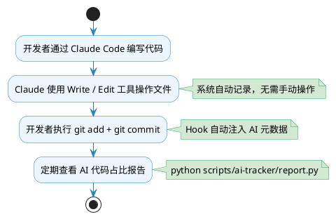

### 7.2 常用命令

```bash
# 查看 AI 代码占比报告
python scripts/ai-tracker/report.py

# 查看最近 20 条 AI 提交
python scripts/ai-tracker/report.py --top 20

# 按时间范围统计（2026年3月以来）
python scripts/ai-tracker/report.py --since 2026-03-01

# 按开发者过滤
python scripts/ai-tracker/report.py --developer administrator

# 只查看 session 文件汇总（快速预览，无需分析 git log）
python scripts/ai-tracker/report.py --sessions-only

# JSON 格式输出（接入 CI/CD）
python scripts/ai-tracker/report.py --format json

# 清空待提交缓冲（出现混乱时）
node scripts/ai-tracker/reset-session.js

# 完全重置统计（慎用）
node scripts/ai-tracker/reset-session.js --full
```

### 7.3 查看当前 session 状态

```bash
# 查看 pendingFiles（待提交的 AI 文件）
cat ai-sessions/$(whoami | tr '[:upper:]' '[:lower:]')-ai-session-*.json | python -c "
import json, sys
d = json.load(sys.stdin)
pending = d.get('pendingFiles', [])
print(f'待提交文件（{len(pending)} 个）：')
for f in pending:
    path = f['path'].split('/')[-1]
    print(f'  {path}（编辑 {f[\"operations\"]} 次）')
print(f'\n统计：操作 {d[\"stats\"][\"totalOperations\"]} 次 | 文件 {d[\"stats\"][\"totalFilesEdited\"]} 个 | 行数 {d[\"stats\"][\"totalAiLines\"]} 行')
"
```

---

## 8. 多人团队协作

### 8.1 零冲突设计

```plantuml
@startuml
skinparam packageBackgroundColor #EBF5FB
skinparam packageBorderColor #2980B9
skinparam packageFontSize 14
skinparam objectBackgroundColor #FFFFFF
skinparam objectBorderColor #555555
skinparam actorBackgroundColor #D5E8D4
skinparam actorBorderColor #27AE60
skinparam arrowColor #555555

actor "张三\nLAPTOP-XYZ" as A
actor "李四\nDESKTOP-ABC" as B
actor "王五\nMACBOOK" as C

package "ai-sessions/" {
  object "zhangsan-ai-session-laptop-xyz.json" as FA {
    developer = zhangsan
    hostname = laptop-xyz
  }
  object "lisi-ai-session-desktop-abc.json" as FB {
    developer = lisi
    hostname = desktop-abc
  }
  object "wangwu-ai-session-macbook.json" as FC {
    developer = wangwu
    hostname = macbook
  }
}

A --> FA : 独立写入
B --> FB : 独立写入
C --> FC : 独立写入

note bottom of FA
  文件名唯一（用户名 + 主机名）
  多人开发不产生 git 冲突
end note
@enduml
```

### 8.2 新成员入职

```bash
# 新成员克隆仓库后，执行一次安装即可
git clone <repo-url>
cd <project>
node scripts/ai-tracker/install.js
# ↑ 自动生成 ai-sessions/{新成员}-ai-session-{主机名}.json
```

### 8.3 跨团队统计

```bash
# report.py 会自动读取 ai-sessions/ 下所有 session 文件
# 输出时按开发者分别展示

python scripts/ai-tracker/report.py
# [ 开发者 AI 使用统计 ]
#   zhangsan   LAPTOP-XYZ    52 操作   1200 行   8 提交   2 个待提交
#   lisi       DESKTOP-ABC   31 操作    780 行   5 提交   0 个待提交
#   wangwu     MACBOOK        8 操作    210 行   2 提交   1 个待提交
```

---

## 9. 报告解读

### 9.1 总体概览

```
[ 总体概览 ]
  总提交数       5 个
  AI 辅助提交    3 个  (60.0%)    ← AI 参与的提交占比
  人工提交       2 个
```

### 9.2 代码行数统计

```
[ 代码行数 ]
  总新增行数     1500 行           ← git log --numstat 所有 added 行
  AI 生成行数     943 行           ← 标注了 AI-Generated:true 的提交的 AI-Lines 之和
  AI 删除行数     120 行           ← AI-Lines-Deleted 之和（新增）
  AI 净增行数     823 行           ← 生成行 − 删除行（新增）
  AI 代码占比    62.9%
  可视化         [##################----------]
```

> **注意**：`AI 代码占比 = AI-Lines / 总新增行数`
> 如果某次提交只有部分文件是 AI 生成的，`AI-Lines ≤ AI-Total-Lines`

### 9.3 开发者统计（来自 session 文件）

```
[ 开发者 AI 使用统计 ]
  开发者           主机            累计操作  AI 生成行  AI 删除行   净增行  提交数  待提交
  administrator    desktop-tc94458    12        943       120       823     5      0 个
```

- **累计操作**：Claude 调用 Write/Edit/NotebookEdit 的次数（原始操作数）
- **AI 生成行**：已提交的 AI 生成行数（来自历次 commit 的 AI-Lines 累加）
- **AI 删除行**：已提交的 AI 删除行数（来自历次 commit 的 AI-Lines-Deleted 累加）
- **净增行**：生成行 − 删除行（真实净贡献）
- **待提交文件**：当前 pendingFiles 中尚未提交的文件数

### 9.4 AI 提交明细

```
[ 最近 3 条 AI 提交 ]
  提交    日期          开发者          AI/总行数    占比    主题
  1aa3647 2026-03-02   administrator      14/28   50.0%  feat(demo): 添加冒泡排序示例
  db51770 2026-03-02   administrator     181/181  100.0%  fix(ai-tracker): 修复统计问题
  158325c 2026-03-01   administrator     743/1154  64.4%  feat(ai-tracker): 实现追踪系统
```

- **AI/总行数**：`AI-Lines / AI-Total-Lines`
- **占比**：本次提交中 AI 生成代码的比例（100% 表示全部由 AI 生成）

---

## 10. 已知限制

### 10.1 统计精度限制

| 限制 | 说明 | 影响 |
|------|------|------|
| **文件级追踪** | 以文件为单位，不区分文件内哪些行是 AI 生成的 | 如果 AI 修改后用户又手动改了部分行，整个文件的行数仍计为 AI 生成 |
| **只统计新增行** | 使用 `git diff --numstat` 的 added 列，删除行不计 | 大量删除代码的重构提交，AI-Lines 可能偏小 |
| **不区分注释/空行** | 代码行、注释行、空行一视同仁 | AI-Lines 包含注释和空行 |
| **二进制文件** | 二进制文件的 `git diff --numstat` 输出为 `-`，跳过 | 图片、字体等文件不统计 |

### 10.2 场景限制

| 场景 | 行为 | 说明 |
|------|------|------|
| AI 修改文件，用户再手动改 | 整个文件计为 AI 生成 | 无法区分每一行的来源 |
| 多个开发者修改同一文件 | 以最后提交者为准 | 协同编辑场景下可能不准确 |
| git amend 重新提交 | 检测到 `AI-Generated:` 则跳过注入 | 避免重复，但行数不会更新 |
| merge commit | 直接跳过（不注入 trailers） | merge 本身不产生新代码 |
| squash commit | 直接跳过 | 同上 |

### 10.3 路径匹配边界情况

```
可能误匹配的场景：
  session 中有 "module_admin/user.py"
  staged 中有 "module_admin_v2/user.py"
  → sp.endsWith(st) 可能误匹配（如果 st = "user.py"）
  → 实际影响很小，因为两个文件名不完全相同
```

---

## 11. Bug 修复记录

### Bug #1：Trailer 写入 Subject 而非 Body

**发现时间**：2026-03-02
**影响版本**：v1.0.x
**症状**：
- `git log %b` 为空，report.py 解析不到任何 AI trailers
- 提交显示为非 AI 提交，行数漏计
- 在 `git log %s`（subject）中能看到所有 trailers（空格分隔）

**根本原因**：

```javascript
// ❌ 旧代码（有 bug）
const trailers = ['', 'AI-Generated: true', ...].join('\n');
//  trailers = "\nAI-Generated: true\n..."
fs.writeFileSync(commitMsgFile, commitMsg.trimEnd() + trailers + '\n');
// 结果：subject\nAI-Generated: true\n...（只有 1 个 \n）
// Git 规则：1 个 \n = 同一段落（subject），2 个 \n = 新段落（body）
// → trailers 全部进入 subject 段落，%b 为空
```

**修复方案**：

```javascript
// ✅ 新代码（已修复）
const trailers = ['AI-Generated: true', ...].join('\n');
fs.writeFileSync(commitMsgFile, commitMsg.trimEnd() + '\n\n' + trailers + '\n');
// 结果：subject\n\nAI-Generated: true\n...（2 个 \n = 空行分隔）
// → trailers 进入 body 段落，%b 正常解析
```

**兼容处理**：在 `report.py` 中新增 `_parse_trailers_from_subject()` 函数，处理历史遗留提交（trailers 在 subject 中的旧格式）。

---

### Bug #3：`--author` 参数别名缺失

**发现时间**：2026-03-06
**影响版本**：v1.1.x
**症状**：
- `install.js` 帮助文档中写明 `--author zhangsan` 是别名
- 实际执行 `python report.py --author zhangsan` 报参数错误（argparse 不识别）

**根本原因**：`argparse.add_argument` 只注册了 `--developer`，未添加 `--author` 别名

**修复方案**：

```python
# ❌ 旧代码
parser.add_argument('--developer', metavar='NAME', ...)

# ✅ 新代码（双名称，共享同一 dest）
parser.add_argument('--developer', '--author', dest='developer', metavar='NAME', ...)
```

---

### Bug #4：删除行统计缺失，净贡献度无法评估

**发现时间**：2026-03-06
**影响版本**：v1.1.x
**症状**：
- 大规模重构提交（大量删除旧代码）中，AI 净贡献度显示偏高
- 无法区分"AI 写了多少代码"与"AI 删了多少代码"
- 重构场景下统计失真

**修复方案**：
1. `prepare-commit-msg.js` 新增统计删除行，注入 `AI-Lines-Deleted` 和 `AI-Total-Lines-Deleted` trailer
2. Session `stats` 新增 `totalAiLinesDeleted` 字段
3. `report.py` 解析新 trailers 并展示生成行、删除行、净增行三项数据

---

### Bug #5：过期 pendingFiles 污染 Trailer

**发现时间**：2026-03-06
**影响版本**：v1.1.x
**症状**：
- 若开发者修改了一批文件但长期未提交（如超过 2 周），这些文件会持续留在 pendingFiles
- 后续其他提交（不含这些文件）的 Trailer 会错误声称这些旧文件是本次提交的 AI 文件

**根本原因**：pendingFiles 没有过期清理机制

**修复方案**：在 `prepare-commit-msg.js` 中引入 14 天 TTL：

```javascript
const STALE_TTL_MS = 14 * 24 * 60 * 60 * 1000;
const pendingFiles = allPendingFiles.filter(f => {
    const ts = new Date(f.lastModified || f.timestamp || 0).getTime();
    return !ts || (nowMs - ts) < STALE_TTL_MS;
});
```

---

### Bug #6：`NotebookEdit` 工具未被追踪

**发现时间**：2026-03-06
**影响版本**：v1.1.x
**症状**：Claude 通过 `NotebookEdit` 工具编辑 `.ipynb` Jupyter 笔记本时，操作不记录到 session

**根本原因**：`post-tool-use.js` 只检查了 `['Write', 'Edit']`，未包含 `NotebookEdit`；且 NotebookEdit 使用 `notebook_path` 而非 `file_path`

**修复方案**：

```javascript
// ❌ 旧代码
if (!['Write', 'Edit'].includes(toolName)) { process.exit(0); }
const filePath = toolInput.file_path || '';

// ✅ 新代码
if (!['Write', 'Edit', 'NotebookEdit'].includes(toolName)) { process.exit(0); }
const filePath = toolInput.file_path || toolInput.notebook_path || '';
```

---

### Bug #7：`session.model` 字段不实时更新

**发现时间**：2026-03-06
**影响版本**：v1.1.x
**症状**：切换 Claude 模型后，session 文件中的 `model` 字段仍显示旧模型名

**根本原因**：`model` 字段只在 session 初始化时写入，后续不更新

**修复方案**：在 `post-tool-use.js` 中每次操作时同步最新模型：

```javascript
const currentModel = process.env.ANTHROPIC_DEFAULT_SONNET_MODEL;
if (currentModel) { session.model = currentModel; }
```

**发现时间**：2026-03-01
**影响版本**：v1.0.x
**症状**：旧版 session 文件使用 `files` 字段，新版使用 `pendingFiles`，跨版本读取报错

**修复方案**：兼容读取两种字段名：

```javascript
// 兼容旧字段名
session.pendingFiles = session.pendingFiles || session.files || [];
delete session.files;  // 统一写回时使用新字段名
```

---

## 12. 故障排查

### 12.1 Hook 不触发

**症状**：Claude 修改文件后，session 文件没有变化

**排查步骤**：
```bash
# 检查 Hook 文件是否存在
ls -la .claude/hooks/post-tool-use.js
# 应该存在且有内容

# 检查 Claude Code 配置（settings.local.json 中的 hooks）
cat .claude/settings.local.json | python -c "import json,sys; d=json.load(sys.stdin); print(d.get('hooks', {}))"
```

### 12.2 提交后 AI Trailers 不显示

**症状**：提交完成后 `git log` 中看不到 AI 元数据

**排查步骤**：
```bash
# 1. 检查 git hook 是否安装
ls -la .git/hooks/prepare-commit-msg
# 应有 -rwxr-xr-x 权限

# 2. 手动执行 hook 测试
echo "test commit" > /tmp/test_commit_msg.txt
node .claude/hooks/prepare-commit-msg.js /tmp/test_commit_msg.txt
cat /tmp/test_commit_msg.txt
# 应该看到 AI trailers（前提是 pendingFiles 非空）

# 3. 检查 pendingFiles 是否有内容
python -c "
import json
with open('ai-sessions/*.json') as f:
    d = json.load(f)
print(f'pendingFiles: {len(d.get(\"pendingFiles\", []))} 个')
"
```

### 12.3 report.py 统计为 0

**症状**：运行报告后 AI 行数为 0

**排查步骤**：
```bash
# 1. 检查 git log 是否有 AI trailers
git log --format="%H%n%b---" | grep -A5 "AI-Generated"
# 如果没有输出，说明 trailers 未注入

# 2. 检查 trailers 是否在 body 中
git log --format="%H%n%s%n%b---END---" HEAD~1..HEAD | head -30
# body_start 到 ---END--- 之间应有 AI trailers

# 3. 如果 trailers 在 subject 中（旧版 bug）
# report.py 的兼容函数会处理，但需确认版本
grep "_parse_trailers_from_subject" scripts/ai-tracker/report.py
```

### 12.4 文件路径匹配失败

**症状**：pendingFiles 有文件，但提交时 AI-Lines 为 0

**排查步骤**：
```bash
# 查看 session 中的路径格式
python -c "
import json
with open('ai-sessions/administrator-ai-session-desktop-tc94458.json') as f:
    d = json.load(f)
for f in d['pendingFiles']:
    print(f['path'])
"
# 示例输出：D:/project/module_admin/service/user_service.py

# 对比 git 暂存区路径
git diff --cached --name-only
# 示例输出：module_admin/service/user_service.py

# 验证匹配：路径尾部应该能匹配
# D:/project/module_admin/service/user_service.py
#           endsWith /module_admin/service/user_service.py ✅
```

---

## 13. 文件目录结构

```
项目根目录/
│
├── .claude/
│   ├── hooks/
│   │   ├── post-tool-use.js          # Claude Code Hook（捕获文件操作）
│   │   ├── prepare-commit-msg.js     # Git Commit Hook 实现（注入 trailers）
│   │   ├── pre-tool-use.js           # 其他 Hook（非追踪系统）
│   │   └── stop.js                   # 其他 Hook（非追踪系统）
│   └── settings.local.json           # Claude Code 配置（Hook 注册）
│
├── .git/
│   └── hooks/
│       ├── prepare-commit-msg        # Git Hook 入口（调用 .claude/hooks/*.js）
│       └── pre-commit                # 防止误提交 .claude/ai-session.json
│
├── ai-sessions/                      # 开发者 session 文件目录（提交到仓库）
│   ├── .gitkeep                      # 确保空目录被 git 追踪
│   └── {username}-ai-session-{hostname}.json  # 每位开发者的 session 文件
│
├── scripts/
│   └── ai-tracker/
│       ├── install.js                # 一键安装脚本（新成员必须运行一次）
│       ├── reset-session.js          # Session 重置工具
│       └── report.py                 # AI 代码占比报告生成器
│
└── .claude/
    └── docs/
        ├── AI代码追踪系统设计手册.md  # 本文档
        └── svg/
            └── ai-code-tracker.svg   # 系统架构可视化图
```

---

## 14. 多 AI 工具适配指南

> 本章说明如何将追踪系统扩展到 Claude Code 以外的 AI 编程工具（如 Codex CLI、OpenCode、Aider），实现统一的 AI 代码占比统计。

### 14.1 适配原理

系统由两层组成，**只有第一层是工具耦合的**：

| 层级 | 组件 | 工具耦合度 | 说明 |
|------|------|-----------|------|
| **Layer 1 捕获层** | `post-tool-use.js` | ⚠️ 强耦合 | 依赖 Claude Code 的 PostToolUse Hook |
| **Layer 2+ 注入层** | Git Hooks、report.py | ✅ 无耦合 | 只读取 `pendingFiles`，与工具无关 |

**适配的本质**：为其他工具实现一个 **Layer 1 替代品**，向 `pendingFiles` 写入相同格式的数据。Git Hooks 和报告系统完全不需要修改。

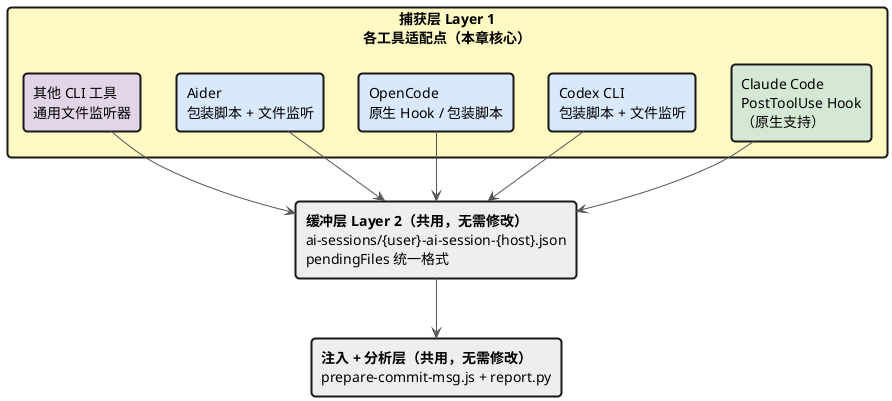

---

### 14.2 适配架构图

三种适配策略，精度依次递减：

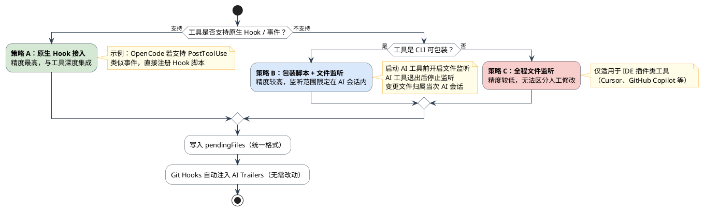

---

### 14.3 核心适配模块：session-writer.js

所有适配方案共用此模块，提供 `recordFile()` 接口向 session 写入文件记录。

**文件**：`scripts/ai-tracker/adapters/session-writer.js`

```javascript
/**
 * AI 追踪系统 - 通用 session 写入模块
 * 所有适配器通过此模块向 pendingFiles 记录 AI 修改的文件
 */
const fs   = require('fs');
const path = require('path');
const os   = require('os');

const sanitize = (s) =>
  (s || 'unknown').replace(/[^a-zA-Z0-9_-]/g, '_').toLowerCase().slice(0, 30);

// 排除不追踪的路径（与 post-tool-use.js 保持一致）
const EXCLUDED = [
  /[\\/]\.claude[\\/]/, /[\\/]\.git[\\/]/,
  /[\\/]node_modules[\\/]/, /[\\/]venv[\\/]/, /[\\/]env[\\/]/,
  /[\\/]__pycache__[\\/]/, /[\\/]dist[\\/]/, /[\\/]build[\\/]/,
  /ai-sessions[\\/]/, /\.pyc$/, /\.pyo$/, /\.log$/, /\.db$/, /\.env$/,
];

function getSessionPath() {
  const u = sanitize(os.userInfo().username);
  const h = sanitize(os.hostname());
  // 在 git 仓库根目录查找 ai-sessions/
  const root = (() => {
    try {
      return require('child_process')
        .execSync('git rev-parse --show-toplevel', { encoding: 'utf8' }).trim();
    } catch { return process.cwd(); }
  })();
  return path.join(root, 'ai-sessions', `${u}-ai-session-${h}.json`);
}

function isExcluded(filePath) {
  const p = filePath.replace(/\\/g, '/');
  return EXCLUDED.some(r => r.test(p));
}

function loadSession(sessionFile) {
  try { return JSON.parse(fs.readFileSync(sessionFile, 'utf8')); }
  catch {
    const u = sanitize(os.userInfo().username);
    const h = sanitize(os.hostname());
    return {
      developer: u, hostname: h,
      model: process.env.AI_MODEL || process.env.AI_TOOL || 'unknown',
      firstSeen: new Date().toISOString(), lastUpdated: new Date().toISOString(),
      stats: { totalOperations: 0, totalFilesEdited: 0,
               totalAiLines: 0, totalAiLinesDeleted: 0, totalCommits: 0 },
      pendingFiles: [],
    };
  }
}

/**
 * 记录一个被 AI 工具修改的文件
 * @param {string} filePath  - 文件路径（绝对或相对均可）
 * @param {string} toolName  - AI 工具名称（如 'codex', 'opencode', 'aider'）
 */
function recordFile(filePath, toolName = 'unknown-ai') {
  if (!filePath || isExcluded(filePath)) return;

  const normalized = path.resolve(filePath).replace(/\\/g, '/');
  const sessionFile = getSessionPath();
  const session     = loadSession(sessionFile);
  const now         = new Date().toISOString();
  const idx         = session.pendingFiles.findIndex(f => f.path === normalized);

  if (idx >= 0) {
    session.pendingFiles[idx].operations  += 1;
    session.pendingFiles[idx].lastTool     = toolName;
    session.pendingFiles[idx].lastModified = now;
  } else {
    session.pendingFiles.push({
      path: normalized, tool: toolName,
      operations: 1, timestamp: now, lastModified: now,
    });
    session.stats.totalFilesEdited += 1;
  }
  session.stats.totalOperations += 1;
  session.lastUpdated = now;

  fs.mkdirSync(path.dirname(sessionFile), { recursive: true });
  fs.writeFileSync(sessionFile, JSON.stringify(session, null, 2));
}

module.exports = { recordFile };
```

---

### 14.4 通用文件监听适配器

利用 Node.js 内置 `fs.watch` 监听目录变化，配合包装脚本使用。

**文件**：`scripts/ai-tracker/adapters/file-watcher.js`

```javascript
#!/usr/bin/env node
/**
 * 通用文件监听适配器
 * 用法：node file-watcher.js --tool=<工具名> [--cwd=<目录>]
 * 配合包装脚本使用：在 AI 工具运行期间监听文件变化
 *
 * 注意：监听期间所有文件变更均归属当前 AI 工具
 *       因此应仅在 AI 工具运行期间启动，退出后立即停止
 */
const fs   = require('fs');
const path = require('path');
const { recordFile } = require('./session-writer');

const args     = Object.fromEntries(
  process.argv.slice(2).map(a => { const [k, v] = a.split('='); return [k, v]; })
);
const toolName = args['--tool'] || 'unknown-ai';
const cwd      = args['--cwd']  || process.cwd();

// 启动时对所有文件做 mtime 快照，防止误记启动前的已有变更
const baseline = new Map();
(function buildBaseline(dir) {
  try {
    for (const e of fs.readdirSync(dir, { withFileTypes: true })) {
      const full = path.join(dir, e.name);
      if (e.isDirectory() && !['node_modules', '.git', '__pycache__', 'venv'].includes(e.name)) {
        buildBaseline(full);
      } else if (e.isFile()) {
        try { baseline.set(full, fs.statSync(full).mtimeMs); } catch {}
      }
    }
  } catch {}
})(cwd);

// fs.watch 递归模式（Node 17.5+ / Windows 原生支持）
try {
  fs.watch(cwd, { recursive: true }, (eventType, filename) => {
    if (!filename) return;
    const fullPath = path.join(cwd, filename);
    try {
      const stat     = fs.statSync(fullPath);
      const prevMtime = baseline.get(fullPath) || 0;
      if (stat.isFile() && stat.mtimeMs > prevMtime) {
        baseline.set(fullPath, stat.mtimeMs);
        recordFile(fullPath, toolName);
        console.error(`[ai-tracker] 记录: ${filename}`);
      }
    } catch {}
  });
  console.error(`[ai-tracker] 监听启动 tool=${toolName} dir=${cwd}`);
} catch (e) {
  console.error(`[ai-tracker] 监听启动失败: ${e.message}`);
  process.exit(1);
}

process.on('SIGTERM', () => { console.error('[ai-tracker] 监听停止'); process.exit(0); });
process.on('SIGINT',  () => { console.error('[ai-tracker] 监听停止'); process.exit(0); });
```

> **平台说明**：`fs.watch` 的 `recursive` 选项在 Windows 和 macOS 上原生支持，Linux 需要 Node.js 22.0+（或改用 `inotifywait`）。

---

### 14.5 Codex CLI 适配方案

**工具**：`@openai/codex`（OpenAI 的终端 AI 编程助手）
**适配策略**：策略 B（包装脚本 + 文件监听）

#### 适配流程

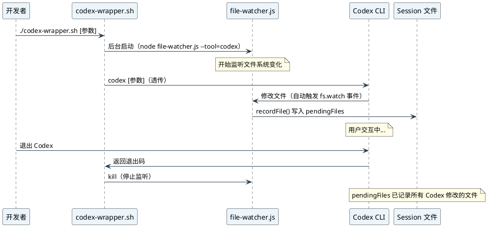

#### 包装脚本

**文件**：`scripts/ai-tracker/adapters/codex-wrapper.sh`

```bash
#!/bin/bash
# Codex CLI AI 追踪包装脚本
# 用法: ./scripts/ai-tracker/adapters/codex-wrapper.sh [codex 参数...]
# 别名配置: alias codex='./scripts/ai-tracker/adapters/codex-wrapper.sh'

SCRIPT_DIR="$(cd "$(dirname "${BASH_SOURCE[0]}")" && pwd)"
PROJECT_ROOT="$(git rev-parse --show-toplevel 2>/dev/null || pwd)"

# 1. 后台启动文件监听器
node "$SCRIPT_DIR/file-watcher.js" --tool=codex "--cwd=$PROJECT_ROOT" &
WATCHER_PID=$!

# 2. 透传所有参数运行 Codex
codex "$@"
CODEX_EXIT=$?

# 3. Codex 退出后停止监听器
kill "$WATCHER_PID" 2>/dev/null
wait "$WATCHER_PID" 2>/dev/null

exit $CODEX_EXIT
```

#### 快速配置（别名方式）

```bash
# 在 ~/.bashrc 或 ~/.zshrc 中添加（推荐方式，对开发者透明）
alias codex='/path/to/project/scripts/ai-tracker/adapters/codex-wrapper.sh'

# 验证：此后正常使用 codex 命令，AI 追踪自动生效
codex
```

#### AI-Tool 标识

Codex 提交的代码在 Git Trailer 中标识为：

```
AI-Tool: codex-wrapper
AI-Model: gpt-4o               ← 可通过 AI_MODEL 环境变量注入
AI-Developer: zhangsan@laptop-xyz
```

> 如需记录精确的 Codex 模型名，可在包装脚本中添加：
> `export AI_MODEL="gpt-4o"` 然后由 `session-writer.js` 读取。

---

### 14.6 OpenCode 适配方案

**工具**：OpenCode（opencode.ai，新一代 TUI AI 编程助手）
**适配策略**：优先策略 A，降级到策略 B

#### 方案 A：原生 Hook 接入（若 OpenCode 支持）

如果 OpenCode 提供类似 Claude Code 的 PostToolUse Hook 机制，可直接注册 `session-writer.js`：

```json
// ~/.opencode/config.json（假设配置格式，以实际文档为准）
{
  "hooks": {
    "postToolUse": {
      "command": "node /path/to/scripts/ai-tracker/adapters/opencode-hook.js"
    }
  }
}
```

对应的 Hook 脚本（格式对标 Claude Code 的 `post-tool-use.js`）：

**文件**：`scripts/ai-tracker/adapters/opencode-hook.js`

```javascript
#!/usr/bin/env node
/**
 * OpenCode PostToolUse Hook
 * 与 Claude Code 的 post-tool-use.js 同等职责
 * 从 stdin 读取工具调用信息，提取文件路径写入 pendingFiles
 */
const { recordFile } = require('./session-writer');

let input = '';
process.stdin.on('data', d => input += d);
process.stdin.on('end', () => {
  try {
    const event    = JSON.parse(input);
    const toolName = event.tool_name || event.toolName || '';
    const toolInput = event.tool_input || event.input || {};

    // 仅追踪写入类工具（根据 OpenCode 实际工具名称调整）
    const WRITE_TOOLS = ['write_file', 'edit_file', 'create_file', 'Write', 'Edit'];
    if (!WRITE_TOOLS.includes(toolName)) process.exit(0);

    const filePath = toolInput.file_path || toolInput.path || toolInput.filename || '';
    if (filePath) recordFile(filePath, 'opencode');
  } catch (e) {
    process.stderr.write(`[ai-tracker] opencode-hook 解析失败: ${e.message}\n`);
  }
  process.exit(0);
});
```

> ⚠️ 以上 Hook 格式为推测设计，**实际配置请以 OpenCode 官方文档为准**。若格式不符，调整字段名即可，核心逻辑不变。

#### 方案 B：包装脚本（降级方案）

**文件**：`scripts/ai-tracker/adapters/opencode-wrapper.sh`

```bash
#!/bin/bash
# OpenCode AI 追踪包装脚本（与 codex-wrapper.sh 结构相同）
SCRIPT_DIR="$(cd "$(dirname "${BASH_SOURCE[0]}")" && pwd)"
PROJECT_ROOT="$(git rev-parse --show-toplevel 2>/dev/null || pwd)"

node "$SCRIPT_DIR/file-watcher.js" --tool=opencode "--cwd=$PROJECT_ROOT" &
WATCHER_PID=$!

opencode "$@"
OPENCODE_EXIT=$?

kill "$WATCHER_PID" 2>/dev/null
wait "$WATCHER_PID" 2>/dev/null
exit $OPENCODE_EXIT
```

```bash
# 别名配置
alias opencode='/path/to/project/scripts/ai-tracker/adapters/opencode-wrapper.sh'
```

---

### 14.7 Aider 适配方案

**工具**：[Aider](https://aider.chat/)（终端 AI 结对编程工具）
**适配策略**：策略 B（包装脚本）+ 利用 Aider 原生 `--read` 输出解析

Aider 的特殊之处：它会**自动提交**每次 AI 修改（除非加 `--no-auto-commits`）。这意味着文件监听方式更准确——Aider 修改文件与 git commit 几乎同步。

#### 适配方案

**文件**：`scripts/ai-tracker/adapters/aider-wrapper.sh`

```bash
#!/bin/bash
# Aider AI 追踪包装脚本
SCRIPT_DIR="$(cd "$(dirname "${BASH_SOURCE[0]}")" && pwd)"
PROJECT_ROOT="$(git rev-parse --show-toplevel 2>/dev/null || pwd)"

# Aider 默认会自动提交，需要让 prepare-commit-msg 在提交前匹配到文件
# 所以文件监听必须在 Aider 整个运行期间持续运行
node "$SCRIPT_DIR/file-watcher.js" --tool=aider "--cwd=$PROJECT_ROOT" &
WATCHER_PID=$!

# 运行 Aider（透传参数）
# 建议加 --no-auto-commits，由开发者手动提交，与追踪系统更好协作
aider "$@"
AIDER_EXIT=$?

kill "$WATCHER_PID" 2>/dev/null
wait "$WATCHER_PID" 2>/dev/null
exit $AIDER_EXIT
```

#### Aider 与自动提交的协作说明

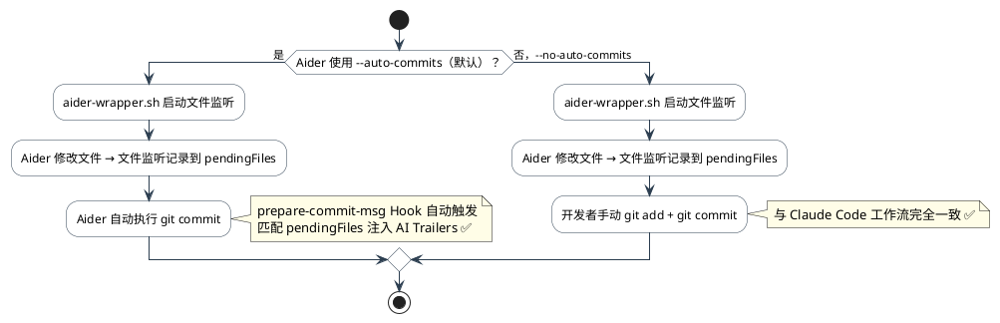

> **推荐**：Aider 与追踪系统协作时，使用 `aider --no-auto-commits` 更符合追踪系统的设计预期（开发者控制提交节奏）。

---

### 14.8 适配方案选型建议


| AI 工具 | 推荐方案 | 精度 | 备注 |
|---------|---------|------|------|
| **Claude Code** | 原生 PostToolUse Hook | ⭐⭐⭐⭐⭐ | 内置支持，精确到每次工具调用 |
| **Codex CLI** | 包装脚本 + 文件监听 | ⭐⭐⭐⭐ | 监听范围限定在 Codex 运行期间 |
| **OpenCode** | 原生 Hook（优先）/ 包装脚本 | ⭐⭐⭐⭐ | 取决于 OpenCode 是否提供 Hook API |
| **Aider** | 包装脚本 + `--no-auto-commits` | ⭐⭐⭐⭐ | 与追踪系统设计理念最契合 |
| **Continue.dev** | 包装脚本（VSCode 插件模式受限） | ⭐⭐⭐ | 需通过 Extension Host 间接触发 |
| **Cursor / Copilot** | 全程文件监听（精度受限） | ⭐⭐ | IDE 插件难以精确区分 AI vs 人工修改 |

#### 共同前提

无论使用哪种方案，**Git Hooks 部分完全不需要改动**：

```bash
# 安装一次，对所有工具永久生效
node scripts/ai-tracker/install.js
```

#### 新文件目录（适配器文件）

适配方案引入的新文件放在统一目录下：

```
scripts/ai-tracker/
├── install.js                          # 原有：一键安装脚本
├── reset-session.js                    # 原有：Session 重置工具
├── report.py                           # 原有：报告生成器
└── adapters/                           # 新增：多工具适配器
    ├── session-writer.js               # 核心：通用 session 写入模块
    ├── file-watcher.js                 # 核心：通用文件监听适配器
    ├── codex-wrapper.sh                # Codex CLI 包装脚本
    ├── opencode-wrapper.sh             # OpenCode 包装脚本
    ├── opencode-hook.js                # OpenCode 原生 Hook（方案 A）
    └── aider-wrapper.sh                # Aider 包装脚本
```

---

## 附录

### A. 快速参考卡

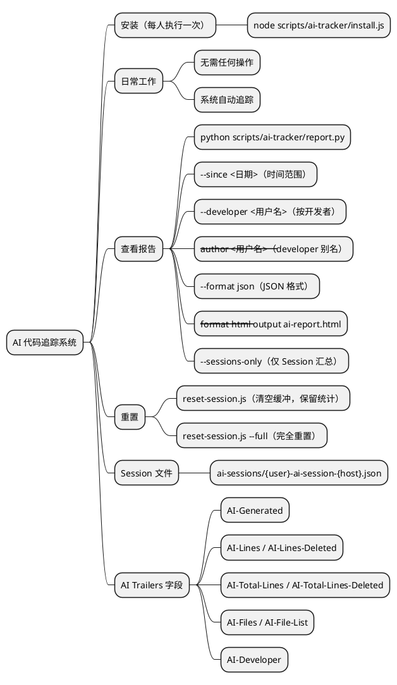

### B. Git Trailer 完整示例

```
feat(system): 新增用户管理模块

实现用户 CRUD 功能，支持分页查询、批量删除、数据导出。
基于三层架构（Controller → Service → DAO）开发。

Co-Authored-By: Claude Sonnet 4.6 <noreply@anthropic.com>

AI-Generated: true
AI-Tool: claude-code
AI-Model: claude-sonnet-4-6
AI-Lines: 350
AI-Lines-Deleted: 45
AI-Total-Lines: 420
AI-Total-Lines-Deleted: 60
AI-Files: 3
AI-File-List: service/user_service.py, controller/user_controller.py, dao/user_dao.py
AI-Developer: administrator@desktop-tc94458
```

### C. 版本历史

| 版本 | 日期 | 变更 |
|------|------|------|
| v1.4.0 | 2026-03-07 | 新增第 14 章：多 AI 工具适配指南（Codex / OpenCode / Aider），通用文件监听适配器，session-writer.js 核心模块 |
| v1.3.0 | 2026-03-07 | 所有 ASCII 图表替换为 PlantUML；文档结构优化 |
| v1.3.0 | 2026-03-06 | 新增 NotebookEdit 追踪；删除行统计（AI-Lines-Deleted）；14天TTL过期清理；--author 别名；report.py 5个新板块；HTML 报告格式 |
| v1.1.0 | 2026-03-02 | 修复 Trailer 空行分隔 bug；新增 subject 兼容解析 |
| v1.0.0 | 2026-03-01 | 初始版本，实现基础追踪功能 |
