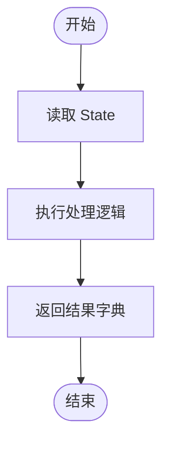
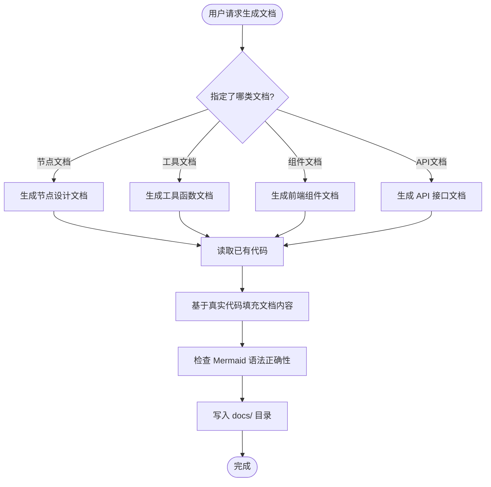

# dev-docs — 端到端研发交付文档生成指南

> **适用于**: nl2sql-langgraph 项目（LangGraph 梭子形架构 + Vue 3 前端）

**图表优先使用 Mermaid**，Mermaid 无法表达的内容才使用 ASCII 图。

---

## 文档目录结构

```
docs/
├── architecture/                # 架构文档
│   ├── overview.md              # 项目架构概述
│   └── langgraph-flow.md        # LangGraph 流程设计
├── backend/                     # 后端文档
│   ├── nodes.md                 # 节点函数设计
│   ├── tools.md                 # 工具函数设计
│   └── api.md                   # API 接口文档
└── frontend/                    # 前端文档
    ├── components.md            # 组件设计
    └── stores.md                # 状态管理设计
```

---

## 文档类型与模板

### 01 — LangGraph 节点设计文档

```markdown
# {节点名} 节点设计文档

> 版本：v1.0.0 | 创建日期：{YYYY-MM-DD}

## 1. 节点概述

{描述本节点在 LangGraph 流程中的职责与位置}

## 2. 输入输出

### 输入（State 字段）

| 字段名 | 类型 | 说明 |
|--------|------|------|
| `question` | str | 用户问题 |

### 输出（返回字典）

| 字段名 | 类型 | 说明 |
|--------|------|------|
| `keywords` | list[str] | 提取的关键词 |

## 3. 处理流程



## 4. 核心代码

```python
# app/nodes.py
async def xxx_node(state: NL2SQLState) -> dict:
    """节点描述"""
    # 实现代码
    pass
```

## 5. 异常处理

| 异常场景 | 处理方式 |
|---------|---------|
| 输入为空 | 返回空结果 |

## 6. 变更记录

| 版本 | 日期 | 修改内容 |
|------|------|---------|
| v1.0.0 | {日期} | 初始版本 |
```

---

### 02 — 工具函数设计文档

```markdown
# {工具名} 工具函数设计文档

> 版本：v1.0.0 | 创建日期：{YYYY-MM-DD}

## 1. 功能概述

{描述本工具函数的功能}

## 2. 函数签名

```python
async def execute_sql(
    query: str,
    max_rows: int = 200
) -> dict:
    """
    执行 SQL 查询

    Args:
        query: SQL 查询语句
        max_rows: 返回最大行数

    Returns:
        dict: 包含 columns 和 rows 的结果
    """
```

## 3. 使用示例

```python
result = await execute_sql(
    'SELECT * FROM fact_orders LIMIT 10',
    max_rows=10
)
print(result['columns'], result['rows'])
```

## 4. 错误处理

| 错误类型 | 处理方式 |
|---------|---------|
| SQL 语法错误 | 抛出 HTTPException |
| 连接失败 | 记录日志并重试 |

## 5. 变更记录

| 版本 | 日期 | 修改内容 |
|------|------|---------|
| v1.0.0 | {日期} | 初始版本 |
```

---

### 03 — 前端组件设计文档

```markdown
# {组件名} 组件设计文档

> 版本：v1.0.0 | 创建日期：{YYYY-MM-DD}

## 1. 组件概述

{描述本组件的功能}

## 2. Props 定义

| Prop 名 | 类型 | 必填 | 说明 |
|---------|------|------|------|
| `data` | any[] | 是 | 表格数据 |

## 3. Emits 定义

| Event 名 | 参数 | 说明 |
|---------|------|------|
| `select` | row | 行选中事件 |

## 4. 使用示例

```vue
<template>
  <ResultTable :data="queryResult" @select="handleSelect" />
</template>
```

## 5. 状态管理

| Store | 使用的字段 | 用途 |
|-------|-----------|------|
| queryStore | columns, rows | 存储查询结果 |

## 6. 变更记录

| 版本 | 日期 | 修改内容 |
|------|------|---------|
| v1.0.0 | {日期} | 初始版本 |
```

---

### 04 — API 接口文档

```markdown
# API 接口文档 — {模块名}

> 版本：v1.0.0 | 更新日期：{YYYY-MM-DD}

## 1. 接口列表

| 方法 | 路径 | 说明 |
|------|------|------|
| POST | /query | 同步查询 |
| GET | /stream | SSE 流式查询 |
| GET | /history | 获取历史记录 |

## 2. 接口详述

### POST /query — 同步查询

**请求体**：

```json
{
  "question": "查询过去30天按地区的订单金额"
}
```

**响应**：

```json
{
  "question": "查询过去30天按地区的订单金额",
  "sql": "SELECT region, SUM(order_amount) AS metric_value FROM fact_orders WHERE ...",
  "columns": ["region", "metric_value"],
  "rows": [["华东", 12345.67], ["华南", 9876.54]],
  "attempt": 1,
  "execution_error": null
}
```

**错误响应**：

| 状态码 | 说明 |
|--------|------|
| 400 | 参数错误 |
| 500 | 服务器内部错误 |

---

### GET /stream — SSE 流式查询

**请求参数**：

| 参数名 | 类型 | 必填 | 说明 |
|--------|------|------|------|
| question | str | 是 | 自然语言问题 |

**事件类型**：

| 事件 | 说明 | 数据结构 |
|------|------|---------|
| init | 初始化 | `{graph: {...}, question: "..."}` |
| node_start | 节点开始 | `{node: "analyze_question", status: "running"}` |
| node_complete | 节点完成 | `{node: "analyze_question", status: "completed"}` |
| result | 最终结果 | `{sql: "...", columns: [...], rows: [...]}` |
| error | 错误 | `{error: "..."}` |

## 3. 变更记录

| 版本 | 日期 | 修改内容 |
|------|------|---------|
| v1.0.0 | {日期} | 初始版本 |
```

---

## 执行规范

### 生成文档的工作流



### Mermaid 语法检查规则

| 规则 | 正确示例 | 错误示例（禁止） |
|------|---------|---------------|
| flowchart 方向 | `flowchart TD` | ~~`graph TD`~~ |
| 节点 ID 不含特殊字符 | `A[开始]` | ~~`A[开始/End]`~~ |
| 子图语法 | `subgraph name["显示名"]` | ~~`subgraph "显示名"`~~ |
| 注释 | `%% 注释内容` | ~~`# 注释`~~ |
| sequenceDiagram 消息 | `A->>B: 消息` | ~~`A->B: 消息`~~ |

### 基于代码生成文档

生成文档时应**先读取相关代码**：

```
读取顺序：
1. app/state.py        → 获取 State 字段定义
2. app/nodes.py        → 获取节点函数实现
3. app/tools.py        → 获取工具函数实现
4. app/graph_builder.py → 了解流程结构
5. frontend/src/       → 获取前端组件实现
```

---

## 常见错误

### Mermaid 语法错误示例

```markdown
❌ 错误 — flowchart 节点括号未闭合
flowchart TD
    A[开始 --> B[结束]

✅ 正确
flowchart TD
    A[开始] --> B[结束]
```

### 文档路径错误

```
❌ docs/xxx.md               （缺少分类目录）
✅ docs/backend/nodes.md
✅ docs/frontend/components.md
```

---

## 注意

- 本技能生成**研发过程文档**
- 若需要**前端对接文档**（供前端使用），请使用 `api-doc-sync` 技能
- 若需要**测试代码**（pytest 用例），请使用 `test-development` 技能
- 若只需要**架构讨论**（不生成文档），请使用 `architecture-design` 技能